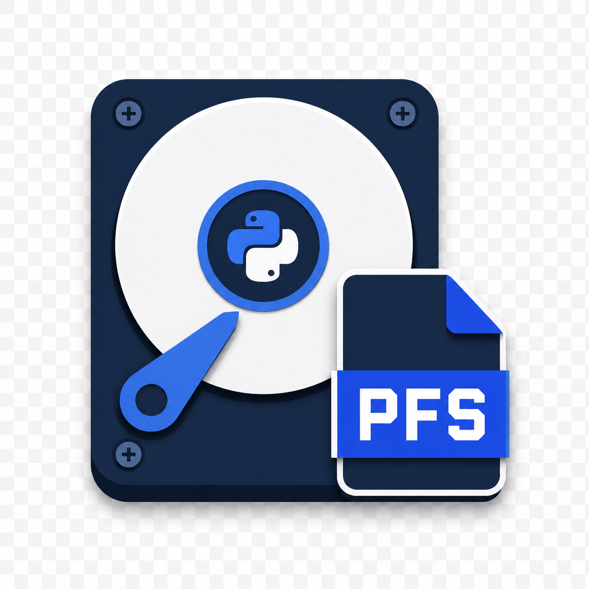
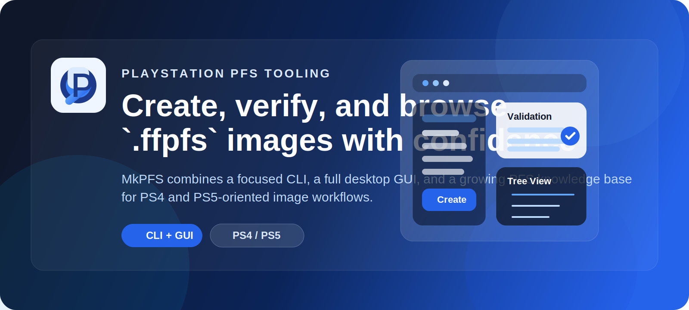
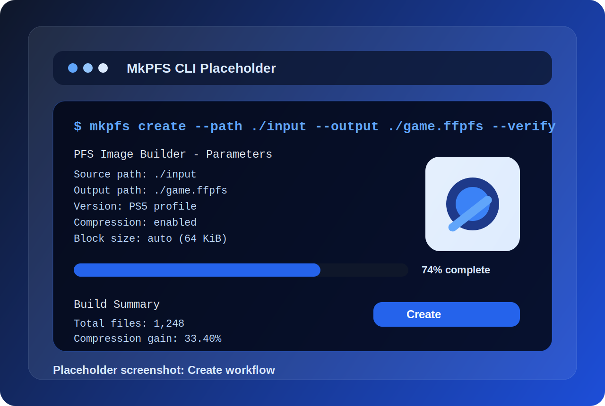
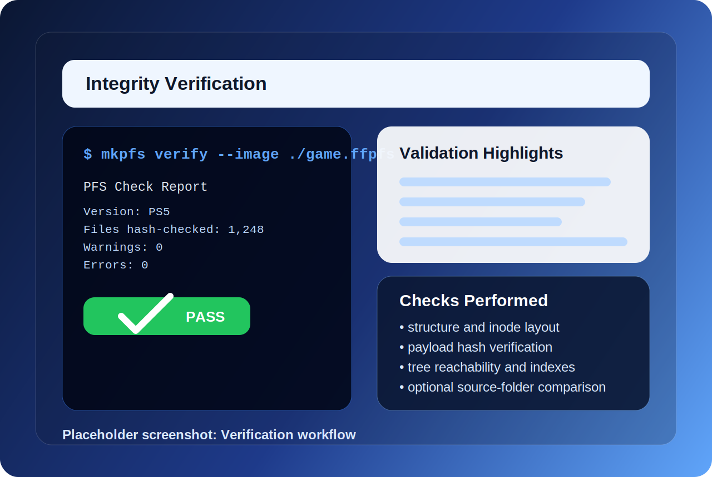
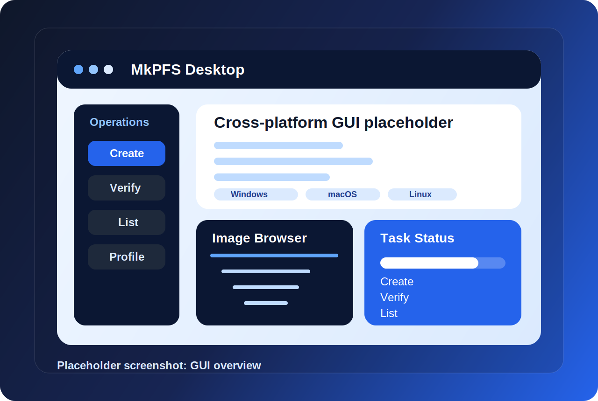

<div align="center">



# MkPFS

### A command-line tool, Python library, and GUI application to manage PlayStation FileSystem (PFS) disk images with support for creating, verifying, and inspecting generated files.

<p>
  <a href="https://github.com/RenanGBarreto/mkpfs/actions"></a>
  <a href="https://pypi.org/project/mkpfs/"></a>
  <a href="LICENSE"></a>
  <a href="https://www.python.org/downloads/release/python-3110/"></a>
  <a href="https://renangbarreto.github.io/MkPFS/"></a>
</p>

<p>
  
  
  
  
  
  
</p>

<p>
  MkPFS is a toolkit for building, verifying, browsing, and managing PlayStation PFS images.
  It works with common image naming conventions such as <code>.ffpfs</code>, <code>.pfs</code>, <code>.dat</code>, and <code>.bin</code>,
  and it is designed for both direct image workflows and PKG/FPKG inner-PFS generation.
</p>

<p>
  <a href="https://renangbarreto.github.io/MkPFS/"><strong>📚 Documentation</strong></a>
  ·
  <a href="#-installation"><strong>📦 Install</strong></a>
  ·
  <a href="#-command-overview"><strong>🧰 Commands</strong></a>
  ·
  <a href="#-gui-application"><strong>🖥️ GUI</strong></a>
  ·
  <a href="#-related-projects--references"><strong>🔗 References</strong></a>
  <br />
  <a href="#-contributors--thanks"><strong>💙 Thanks</strong></a>
  ·
  <a href="https://github.com/sponsors/RenanGBarreto"><strong>💖 Sponsor</strong></a>
</p>

</div>

---

<p align="center">
  
</p>

<p align="center">
  <a href="https://github.com/sponsors/RenanGBarreto">
    
  </a>
</p>

<p align="center">
  <strong>If MkPFS saves you time, helps your research, or becomes part of your workflow, please consider funding the project.</strong><br />
  Sponsorship keeps new features, the upcoming GUI, documentation work, packaging, and testing effort moving forward.
</p>

## 🎯 Why MkPFS

MkPFS is designed to be a clean and practical entry point for PlayStation PFS image workflows:

- Create and manage PFS disk images for PlayStation-oriented workflows
- Verify structure, payload hashes, layout consistency, and source-tree matches
- Inspect image contents quickly with a tree view instead of digging through raw structures
- Work with common image extensions such as `.ffpfs`, `.pfs`, `.dat`, and `.bin`
- Use the generated images with tools like [ShadowMountPlus](https://github.com/drakmor/ShadowMountPlus)
- Build the inner PFS filesystem used inside PKG or FPKG workflows
- Use the same core workflow from both the CLI, the Python library, and the cross-platform GUI
- Explore a bundled, source-backed knowledge base for PFS and PKG research

## ✨ Main Features


<table>
  <tr>
    <td width="55%" valign="top">
      <h3>⚙️ Create PFS Images Fast</h3>
      <p>
        Turn a prepared folder into a PFS image with compression, profile selection, inode mode control,
        dry runs, and post-build verification support. MkPFS is built around the actual image lifecycle instead
        of forcing you through low-level manual steps.
      </p>
      <p>
        Great for repeatable packaging workflows, rapid iteration, PKG/FPKG inner-PFS generation, and eventually one-click GUI builds.
      </p>
    </td>
    <td width="45%" valign="top">
      
    </td>
  </tr>
  <tr>
    <td width="45%" valign="top">
      
    </td>
    <td width="55%" valign="top">
      <h3>🔍 Verify With Confidence</h3>
      <p>
        Run structural checks, confirm payload hashes, compare an image to its source tree, and inspect CRC32
        or manifest digest expectations. The goal is to make validation obvious and repeatable instead of an
        afterthought.
      </p>
      <p>
        The <code>verify</code> alias is especially handy when you want that intent to be visible in scripts, release pipelines,
        and compatibility checks before using the image with ShadowMountPlus or packaging it into a PKG/FPKG workflow.
      </p>
    </td>
  </tr>
  <tr>
    <td width="55%" valign="top">
      <h3>🖥️ Use CLI, Library, or GUI</h3>
      <p>
        MkPFS is positioned as a command-line tool, Python library, and desktop GUI for the same core image workflow:
        create, verify, browse, and manage images from a modern interface available on Windows, macOS, and Linux.
      </p>
      <p>
        That makes MkPFS useful both for automation-heavy users and for people who want visual workflows, progress feedback,
        and easier discovery of advanced capabilities.
      </p>
    </td>
    <td width="45%" valign="top">
      
    </td>
  </tr>
</table>

## 🖥️ GUI Application

The MkPFS GUI is a full-featured desktop front end for the same core engine that powers the CLI and library.

- Available for Windows, macOS, and Linux
- Covers everything the CLI does: create, verify, and inspect images
- Designed for both one-off manual work and repeated packaging workflows
- Visual file browser for tree navigation and image inspection
- Progress-aware operations for large image creation and verification jobs
- Preset-friendly workflows for common PS4 and PS5 build targets
- Better onboarding for users who do not want to start with terminal commands

If you can do it in the command line, you can do it in the GUI as well.

## 📦 Installation

### Run from a local checkout

```bash
uv sync --group dev
uv run mkpfs -h
```

### Install as a local tool

```bash
uv tool install .
mkpfs -h
```

### Install from PyPI

```bash
uv tool install mkpfs
mkpfs -h
```

### Build distributables

```bash
uv build
uv run --frozen twine check dist/*
```

## ⌨️ Command Overview

MkPFS keeps the command surface focused on the image lifecycle.

### `create`

Create a new PFS image from a source folder.

```bash
mkpfs create --path ./input --output ./game.ffpfs
```

Use this command when you want to:

- Build a new image from a folder tree
- Produce PS4 or PS5 oriented layouts
- Generate files for `.ffpfs`, `.pfs`, `.dat`, or `.bin` naming conventions
- Prepare an inner PFS image for future PKG or FPKG usage
- Enable compression and optional post-create verification

### `check`

Validate an existing image and print a detailed report.

```bash
mkpfs check --image ./game.ffpfs
```

Use this command when you want to:

- Confirm the image structure is valid
- Re-check hashes and internal layout
- Compare the image against its original source folder
- Review integrity data before testing, packaging, or distribution

### `verify`

Alias of `check` with the same behavior.

```bash
mkpfs verify --image ./game.ffpfs
```

Use this when you want validation intent to be explicit in scripts, CI jobs, release steps, or ShadowMountPlus compatibility workflows.

### `ls`

Print the filesystem tree stored inside an image.

```bash
mkpfs ls --image ./game.ffpfs
```

Use this command when you want to:

- Browse image contents quickly
- Confirm file placement without extracting data
- Inspect results after creating, receiving, or verifying an image

## 🔁 Typical Workflow

```bash
# 1. Create an image from a source tree
mkpfs create --path ./input --output ./output.ffpfs

# 2. Verify the generated image
mkpfs verify --image ./output.ffpfs

# 3. Inspect the final tree layout
mkpfs ls --image ./output.ffpfs
```

## 📚 Documentation

MkPFS ships with a curated documentation site that mixes user guidance with research material.

- Getting started: https://renangbarreto.github.io/MkPFS/getting-started/
- Command reference: https://renangbarreto.github.io/MkPFS/commands/
- Knowledge base: https://renangbarreto.github.io/MkPFS/knowledge/
- Published site: https://renangbarreto.github.io/MkPFS/

## 🛠️ Development

Set up the local environment:

```bash
uv sync --group dev
uv run pre-commit install
```

Run the validation commands:

```bash
./run-tests.sh
uv run --frozen ruff format .
uv run --frozen ruff check .
```

Preview the docs locally:

```bash
python scripts/sync_docs_sources.py
uv run mkdocs serve
```

## 💖 Sponsorship

MkPFS is easier to sustain when users who benefit from it help fund it.

<p>
  <a href="https://github.com/sponsors/RenanGBarreto">
    
  </a>
</p>

Support helps with:

- Ongoing CLI improvements
- The Python library and reusable internals
- GUI polishing and packaging
- Better test coverage and compatibility work
- More documentation, examples, and research notes

Sponsor here:

- https://github.com/sponsors/RenanGBarreto

## 💙 Special thanks and Contributors

Special thanks to the people and communities helping shape MkPFS:

- **RenanGBarreto** — main creator and maintainer of MkPFS
- **Darkmor** — creator of [ShadowMountPlus](https://github.com/drakmor/ShadowMountPlus), whose work helped inspire practical PFS mounting workflows
- **The PlayStation and reverse-engineering community** — for tools, research threads, testing feedback, technical notes, and historical knowledge
- **Community-maintained references and wiki pages** — especially the projects and archives that preserve PFS, PKG, and FPKG implementation details

## 🔗 Related projects

- [ShadowMountPlus](https://github.com/drakmor/ShadowMountPlus) — practical PS5 auto-mounter and a key reference for `.ffpfs` compatibility
- [MkPFS documentation site](https://renangbarreto.github.io/MkPFS/) — user docs and knowledge base
- [PSDevWiki PFS](https://www.psdevwiki.com/ps4/PFS) — community reference for PFS on-disk structures
- [PSDevWiki PKG files](https://www.psdevwiki.com/ps4/PKG_files) — PKG format reference and tooling pointers
- [ShadPKG HOWWORKS](https://github.com/seregonwar/ShadPKG/blob/main/docs/HOWWORKS.md) — implementation-focused PKG/PFS decryption walkthrough
- [Wololo: PS4 FPKG writeup by Flatz](https://wololo.net/ps4-fpkg-writeup-by-flatz/) — historical writeup on FPKG/PKG techniques
