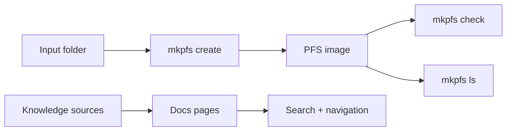

# MkPFS documentation

  

    
PlayStation file-system tooling

    <h1>Build, check, and inspect PFS images with a curated knowledge base.</h1>
    

      MkPFS documents the command-line tool itself and the wider PFS / PKG research
      trail that informed it. The site is designed to grow into a full reference hub
      with screenshots, diagrams, and source-backed notes.
    

    

      <a class="md-button md-button--primary" href="getting-started/">Get started</a>
      <a class="md-button" href="knowledge/">Explore the knowledge base</a>
      <a class="md-button md-button--secondary" href="https://github.com/sponsors/RenanGBarreto">Sponsor</a>
    

  

  

    <h2>What the site covers</h2>
    <ul>
      <li>mkpfs install, create, check, and ls usage</li>
      <li>Source-backed knowledge pages for PFS and PKG material</li>
      <li>Planned screenshots, diagrams, and workflow notes</li>
    </ul>
  

## Start here

1. Read [Getting Started](getting-started.md) for install and first-run commands.
2. Open [Commands](commands/index.md) for the live CLI reference.
3. Visit [Knowledge Base](knowledge/index.md) for the longer-form PFS / PKG material.

## Sponsor

If the project is useful to you, support it on GitHub Sponsors so the docs and tool can keep moving.
